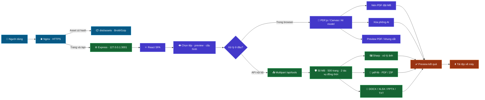
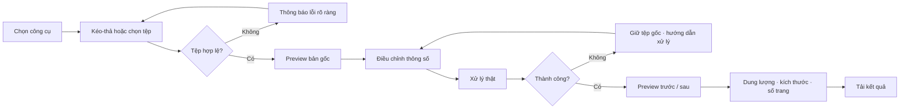
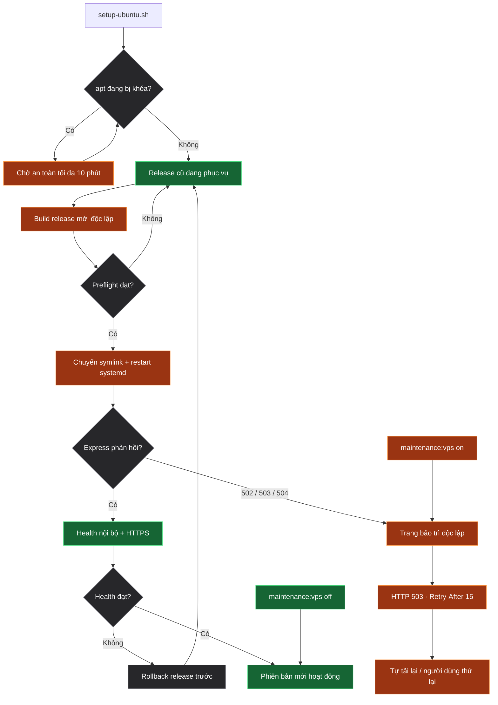

# Sơ đồ hoạt động PDFTools

Tài liệu này là bản đồ trực quan của kiến trúc, luồng người dùng và toàn bộ chức năng đang hoạt động. Khi thêm, xóa, đổi tên hoặc chuyển nơi xử lý một chức năng, phải cập nhật file này trong cùng thay đổi code.

## 1. Kiến trúc và luồng dữ liệu

Tệp được xử lý trong bộ nhớ hoặc trong browser. Luồng hiện tại không tạo kho lưu trữ tệp người dùng lâu dài.

## 2. Bản đồ chức năng

```mermaid
flowchart TB
    ROOT["PDFTools · 15 công cụ"]
    ROOT --> PDF["📄 9 công cụ PDF"]
    ROOT --> IMG["🖼️ 6 công cụ ảnh"]

    PDF --> PE["Chỉnh sửa PDF<br/>chữ · watermark · số trang"]
    PDF --> PC["Nén PDF<br/>đặt MB / không mất dữ liệu"]
    PDF --> PM["Ghép PDF<br/>kéo thứ tự · xoay · chèn"]
    PDF --> PO["Sắp xếp PDF<br/>kéo-thả · nhân bản · xóa"]
    PDF --> PS["Tách PDF<br/>chọn thumbnail · xuất ZIP"]
    PDF --> PW["PDF sang Word"]
    PDF --> PX["PDF sang Excel"]
    PDF --> PP["PDF sang PowerPoint"]
    PDF --> PT["PDF sang văn bản"]

    IMG --> IR["Xóa phông nền<br/>AI trong browser"]
    IMG --> IC["Chuyển đổi định dạng<br/>JPG / PNG / WebP / AVIF"]
    IMG --> IZ["Thay đổi kích thước"]
    IMG --> IK["Cắt ảnh<br/>khung kéo-thả"]
    IMG --> IN["Nén ảnh"]
    IMG --> IE["Chỉnh sửa ảnh<br/>màu · xoay · lật"]

    classDef root fill:#312e81,stroke:#a5b4fc,color:#fff;
    classDef pdf fill:#075985,stroke:#38bdf8,color:#fff;
    classDef image fill:#166534,stroke:#4ade80,color:#fff;
    class ROOT root;
    class PDF,PE,PC,PM,PO,PS,PW,PX,PP,PT pdf;
    class IMG,IR,IC,IZ,IK,IN,IE image;
```

## 3. Luồng sử dụng chung

## 4. Production, cập nhật và bảo trì

## 5. Quy tắc cập nhật sơ đồ

Trong cùng commit thay đổi chức năng:

1. Đối chiếu danh sách `pdfTools` và `imageTools` trong `src/App.jsx` với mục **Bản đồ chức năng**.
2. Nếu đổi xử lý browser/API, cập nhật **Kiến trúc và luồng dữ liệu**.
3. Nếu đổi preview, validation hoặc kết quả tải xuống, cập nhật **Luồng sử dụng chung**.
4. Nếu đổi CI, Nginx, systemd, deploy, health hoặc rollback, cập nhật **Production, cập nhật và bảo trì**.
5. Kiểm tra Mermaid render được trên GitHub trước khi phát hành.
