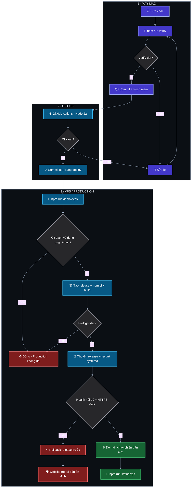

# PDFTools

Ứng dụng web xử lý PDF và ảnh, xây dựng bằng React, Vite, Node.js và Express.


> [!TIP]
> **Local:** [http://localhost:5175](http://localhost:5175) · **Website:** [https://congcuweb.duckdns.org](https://congcuweb.duckdns.org)

## ✨ Tính năng đang hoạt động

- Nén, đổi định dạng, đổi kích thước và cắt ảnh, với preview trước/sau và thống kê dung lượng thực tế.
- Cắt ảnh bằng khung kéo-thả, di chuyển và thu phóng trực tiếp; hỗ trợ tỷ lệ tự do, 1:1, 4:3 và 16:9.
- Xóa phông bằng AI chạy trong trình duyệt (JPG, PNG, WebP). Chế độ Nhanh dùng mô hình ~40 MB; Chất lượng cao dùng ~80 MB. Mô hình được tải và lưu cache khi dùng lần đầu.
- Preview PDF hai lớp: ưu tiên trình xem có sẵn của browser, tự chuyển sang PDF.js nếu browser không hỗ trợ; có điều hướng từng trang.
- Nén PDF theo dung lượng MB thực tế, tự cân chỉnh độ phân giải và chất lượng nhiều lượt để kết quả nằm sát phía dưới mục tiêu. Có hồ sơ **Tài liệu/chữ** và **Ảnh/màu**, hiển thị DPI thực tế sau nén.
- Chế độ **Không mất dữ liệu** giữ chữ có thể chọn/copy, liên kết và biểu mẫu. Chế độ này chỉ tối ưu cấu trúc PDF nên tệp đã nén tốt có thể giảm 0% — khi đó giao diện giải thích rõ thay vì báo thành công chung chung.
- Ghép PDF bằng bảng thumbnail: chọn, kéo đổi thứ tự, xoay, xóa và chèn thêm PDF tại vị trí mong muốn.
- Tách PDF bằng cách chọn trực tiếp thumbnail, hỗ trợ chọn tất cả, trang lẻ, trang chẵn và xoay trước khi xuất ZIP.
- Chỉnh PDF bằng cách thêm chữ Unicode/watermark theo vị trí, phạm vi trang và độ trong suốt; hỗ trợ tự đánh số `Trang N / Tổng`.
- Chuyển phần chữ có thể chọn trong PDF sang **Word, Excel, PowerPoint hoặc TXT**, có preview nội dung trước khi chuyển. Word giữ ngắt trang, Excel tạo một sheet mỗi trang, PowerPoint tạo slide với chữ có thể sửa.
- Chỉnh ảnh trực quan: độ sáng, tương phản, bão hòa, sắc độ, làm mờ, trắng-đen, xoay và lật; preview dùng cùng thông số với ảnh kết quả.
- Bộ nhận diện PDFTools thống nhất trên thanh điều hướng, footer và tab trình duyệt; có SVG gốc, favicon PNG, Apple Touch Icon và icon PWA 192/512 px.
- Footer có liên hệ trực tiếp với Danh Phạm qua Facebook, Zalo và Telegram.
- Dark mode, tìm kiếm công cụ và giao diện responsive.
- Footer hiển thị `Danh Phạm` và phiên bản dễ đọc, ví dụ `Phiên bản 1.1.0 · Bản dựng #14`; số bản dựng tự tăng theo Git commit.

> [!NOTE]
> Chuyển Office ưu tiên **nội dung có thể chỉnh sửa**, không sao chép hoàn hảo toàn bộ bố cục. PDF scan/ảnh chưa có chữ chọn được sẽ được từ chối kèm hướng dẫn OCR; giới hạn hiện tại là 100 trang và 25 MB. Chỉnh PDF hiện thêm lớp chữ/watermark hoặc số trang, chưa xóa hay sửa trực tiếp chữ gốc.

## 🚀 Hướng dẫn nhanh

> [!TIP]
> Xem [DIAGRAMS.md](DIAGRAMS.md) để hiểu trực quan kiến trúc, 14 chức năng, luồng xử lý tệp và production/bảo trì.

### 💻 1. Chạy website trên máy Mac

Mở Terminal trong VS Code, đi vào thư mục dự án rồi khởi động:

```bash
cd "/Users/danhpham/Documents/ChatGPT/Tool Web All"
npm run dev
```

| Lệnh | Giải thích |
| --- | --- |
| `cd ".../Tool Web All"` | Đi vào đúng thư mục dự án trên Mac. Dấu ngoặc kép cần thiết vì đường dẫn có khoảng trắng. |
| `npm run dev` | Khởi động đồng thời giao diện Vite và Express API. |

Khi Terminal hiện hai dòng dưới đây và chưa trả lại dấu nhắc `%`, website đang chạy:

```text
Local: http://localhost:5175/
ToolHub listening on http://127.0.0.1:3001
```

> [!IMPORTANT]
> Mở [http://localhost:5175](http://localhost:5175), giữ tab Terminal hoạt động và nhấn `Control + C` khi muốn dừng.

Nếu thấy `EADDRINUSE` hoặc `Port 5175 is in use`, một dev server khác đang chạy. Không chạy thêm lần nữa; mở localhost hiện tại hoặc tìm PID bằng:

```bash
lsof -nP -iTCP:5175 -sTCP:LISTEN
lsof -nP -iTCP:3001 -sTCP:LISTEN
```

Hai lệnh `lsof` chỉ kiểm tra tiến trình nào đang dùng cổng giao diện `5175` và API `3001`; chúng không dừng hoặc thay đổi tiến trình.

### 🧰 2. Cài trên máy mới

Cần Node.js 22.12+ và Git. Sau đó chạy một lần:

```bash
git clone https://github.com/phamcongdanh98/Web-tool-ALL.git
cd Web-tool-ALL
npm ci
npm run dev
```

| Lệnh | Giải thích |
| --- | --- |
| `git clone ...` | Tải repository từ GitHub về máy. |
| `cd Web-tool-ALL` | Đi vào thư mục vừa clone. |
| `npm ci` | Cài đúng phiên bản dependency trong `package-lock.json`. |
| `npm run dev` | Chạy website local. |

> [!NOTE]
> Ứng dụng chạy được mà không cần database. `.env` chỉ cần khi cấu hình dịch vụ bên ngoài và tuyệt đối không được commit.

### 🌐 3. Đưa code mới lên domain

Luồng chuẩn:

```text
Sửa code → Kiểm tra → Commit → Push GitHub → CI xanh → Deploy VPS → Mở domain
```

### 🗺️ Sơ đồ cập nhật từ Mac lên website



Nhánh màu đỏ giúp thấy rõ điểm dừng hoặc rollback; production chỉ đổi phiên bản sau khi toàn bộ kiểm tra cần thiết đều đạt.

Trước tiên, xem trạng thái đồng bộ bằng một lệnh:

```bash
npm run status:vps
```

Lệnh này chỉ đọc dữ liệu và hiển thị trực quan Mac, GitHub, VPS, release đang chạy, trạng thái website cùng trạng thái nén asset Brotli/Gzip. Nếu VPS cũ hơn GitHub hoặc Nginx chưa nén asset, lệnh sẽ nhắc bước cần làm.

Chạy lần lượt trong Terminal trên Mac:

```bash
npm run verify
git add .
git commit -m "mô tả thay đổi"
git push origin main
npm run deploy:vps
```

| Bước | Lệnh | Giải thích |
| --- | --- | --- |
| 🔎 Trạng thái | `npm run status:vps` | So sánh phiên bản giữa Mac, GitHub, VPS và domain. |
| 🧪 Kiểm tra | `npm run verify` | Build và thử production, ảnh, PDF trước khi phát hành. |
| 📦 Chuẩn bị | `git add .` | Đưa toàn bộ file đã sửa vào commit sắp tạo. |
| 🏷️ Tạo phiên bản | `git commit -m "..."` | Tạo commit mới; footer tự tăng số **Bản dựng**. |
| ☁️ Đồng bộ | `git push origin main` | Đẩy commit từ Mac lên nhánh `main` của GitHub. |
| 🚀 Phát hành | `npm run deploy:vps` | Đưa đúng commit lên VPS, kiểm tra domain và rollback nếu lỗi. |

> [!IMPORTANT]
> Sau `git push`, chờ job **Verify Node 22** trong GitHub Actions chuyển màu xanh rồi mới chạy deploy. Khi hoàn tất, mở website và đối chiếu số **Bản dựng** ở footer.

Chỉ khi thay đổi file Nginx hoặc `systemd` mới chạy thêm một lần:

```bash
ssh orace 'cd /var/www/pdftools && sudo ./deploy/setup-ubuntu.sh'
```

Không chạy lệnh setup này cho các lần chỉ sửa giao diện hoặc chức năng.

> [!WARNING]
> Bản tối ưu tốc độ PDF ngày 2026-08-23 có thay đổi Nginx. Sau khi commit/push và chạy `npm run deploy:vps`, cần chạy lệnh setup ở trên **một lần** để Nginx phục vụ asset nén trực tiếp. Các lần deploy code sau đó không cần chạy lại setup.

### 🔄 4. Làm việc trên hai máy

Trước khi bắt đầu trên máy vừa chuyển sang:

```bash
git status
git pull --ff-only
npm ci
```

Không sửa đồng thời trên cùng một nhánh ở hai máy. Chỉ coi hai máy đã đồng bộ sau khi commit được push lên GitHub.

| Lệnh | Giải thích |
| --- | --- |
| `git status` | Xem máy hiện tại có file chưa commit hay không. |
| `git pull --ff-only` | Nhận commit mới nhất từ GitHub mà không tự tạo merge commit. |
| `npm ci` | Đồng bộ dependency theo lockfile mới nhất. |

### 🩺 5. Kiểm tra VPS khi có lỗi

Lệnh tiện nhất để xem tổng thể CPU, RAM, swap, ổ đĩa, tiến trình và health:

```bash
npm run monitor:vps
```

Muốn màn hình tự cập nhật mỗi 5 giây:

```bash
npm run monitor:vps -- --watch 5
```

Nhấn `Control + C` để dừng chế độ theo dõi. Các màu có ý nghĩa: 🟢 dưới 70%, 🟡 từ 70% và 🔴 từ 85%. Hai lệnh chỉ đọc dữ liệu, không restart hoặc thay đổi VPS.

Khi cần xem log chi tiết:

```bash
ssh orace 'systemctl status pdftools --no-pager'
ssh orace 'journalctl -u pdftools -n 100 --no-pager'
curl https://congcuweb.duckdns.org/api/health
```

| Lệnh | Giải thích |
| --- | --- |
| `systemctl status` | Xem dịch vụ PDFTools đang chạy hay đã lỗi. |
| `journalctl` | Xem 100 dòng log gần nhất để tìm nguyên nhân. |
| `curl .../api/health` | Kiểm tra website public có trả trạng thái khỏe hay không. |

### 🛠️ Giao diện bảo trì khi cập nhật

Nginx tiếp tục phục vụ phiên bản cũ trong lúc release mới đang `npm ci`, build và preflight. Chỉ trong khoảng Express restart hoặc tạm không phản hồi 502/503/504, Nginx tự trả trang bảo trì độc lập với:

- Logo PDFTools, dark/light mode và giao diện responsive.
- HTTP `503` cùng `Retry-After: 15`, không cache trang lỗi.
- Bộ đếm 15 giây, tự tải lại và nút thử lại ngay.
- Không phụ thuộc Node, CDN hoặc asset của release đang chuyển đổi.

Vì thay đổi này bổ sung cấu hình Nginx, sau khi commit/push và deploy code cần chạy **một lần** trên VPS:

```bash
ssh orace 'cd /var/www/pdftools && sudo ./deploy/setup-ubuntu.sh'
```

Setup nhận biết release hiện tại đang healthy nên không cài dependency/build lại lần thứ hai. Các lần cập nhật code thông thường sau đó chỉ cần `npm run deploy:vps`; không chạy lại setup nếu cấu hình hạ tầng không đổi.

Kiểm tra trạng thái bảo trì:

```bash
npm run maintenance:vps -- status
```

Bật thủ công trước một thay đổi hạ tầng cần ngắt website, rồi tắt sau khi hoàn tất:

```bash
npm run maintenance:vps -- on
npm run deploy:vps
npm run maintenance:vps -- off
```

`on` yêu cầu public trả đúng HTTP 503; nếu Nginx chưa có cấu hình mới, lệnh tự xóa cờ để website không bị kẹt. Khi bảo trì đang bật, deploy vẫn kiểm tra health nội bộ và chờ lệnh `off` mới kiểm tra public HTTPS.

Hướng dẫn cài VPS, domain, HTTPS và rollback chi tiết nằm trong [`deploy/README.md`](deploy/README.md).

## 🗂️ Cấu trúc chính

```text
src/App.jsx       Giao diện React và luồng xử lý tệp
src/styles.css    Hệ thống giao diện và responsive layout
server.js         Express API xử lý ảnh/PDF
lib/pdf-office.js Trích xuất chữ PDF và tạo DOCX/XLSX/TXT
lib/pptx.js       Tạo PowerPoint OOXML với chữ có thể sửa
vite.config.js    Vite và proxy /api sang Express
deploy/           Script release, systemd, Nginx và hướng dẫn VPS
scripts/          Smoke/E2E production dùng cho local và CI
.github/workflows CI tự động trên push và pull request
.env.example      Biến môi trường mẫu
AGENTS.md         Hướng dẫn dành cho Codex
DIAGRAMS.md       Sơ đồ kiến trúc, chức năng, luồng sử dụng và production
```

## 💬 Liên hệ

- Facebook: [Danh Phạm](https://www.facebook.com/danhpham100898)
- Zalo: [0356 719 463](https://zalo.me/0356719463)
- Telegram: [0356 719 463](https://t.me/+84356719463)

## 📝 Nhật ký thay đổi gần đây

### 2026-08-24

- Thiết kế bộ nhận diện PDFTools mới: biểu tượng chồng tài liệu kết hợp tia sáng, dùng tông tím indigo và cyan đồng bộ với giao diện sản phẩm.
- Thay ký tự `P` cũ ở header/footer bằng logo thật; bổ sung wordmark SVG để tái sử dụng cho tài liệu hoặc màn hình giới thiệu.
- Thêm favicon SVG và PNG 32 px, Apple Touch Icon 180 px, icon PWA 192/512 px cùng `site.webmanifest`; khai báo đầy đủ trong `index.html` để browser và thiết bị nhận đúng biểu tượng.
- Thêm sơ đồ Mermaid trực quan mô tả toàn bộ luồng Mac → verify → GitHub Actions → deploy VPS → health check/rollback; xem được ngay trên GitHub, còn VS Code cần trình preview có hỗ trợ Mermaid.
- Thêm `npm run monitor:vps` để xem CPU, RAM, swap, disk, load, top process, trạng thái systemd/Nginx và health bằng một lệnh; hỗ trợ `-- --watch 5` để tự làm mới.
- Thêm giao diện bảo trì độc lập và Nginx fallback 502/503/504: trả HTTP 503 + `Retry-After`, tự tải lại sau 15 giây và không phụ thuộc ứng dụng đang restart.
- Tối ưu `setup-ubuntu.sh`: nếu release hiện tại đã healthy thì chỉ cập nhật hạ tầng/Nginx, không chạy lại toàn bộ `npm ci` và build lần thứ hai.
- Đã thử `monitor:vps` qua SSH thật; kiểm tra trang bảo trì bằng browser ở 1280×720 gồm nội dung accessibility, căn giữa, không tràn ngang, bộ đếm và nút tải lại. `npm run verify` đã qua build, smoke và toàn bộ E2E API.
- Thêm `DIAGRAMS.md` với sơ đồ kiến trúc, bản đồ 14 chức năng, luồng người dùng và production/bảo trì; `npm run check:diagrams` khiến verify thất bại nếu danh sách công cụ đổi mà sơ đồ chưa cập nhật.
- Thêm `npm run maintenance:vps -- status|on|off`; trạng thái đọc được đã thử qua SSH và website đang tắt bảo trì với HTTP 200. `on/off` chưa chạy trên production để tránh chủ động ngắt website trong lúc phát triển.
- Thay cột liên kết mẫu ở footer bằng Facebook, Zalo và Telegram thật của Danh Phạm; giữ số điện thoại hiển thị để người dùng có thể tìm thủ công khi deep link bị giới hạn.
- Đã render kiểm tra logo/icon, xác nhận kích thước và MIME qua localhost; `npm run verify` đã qua toàn bộ production build, smoke test và E2E ảnh/PDF/Office.
- `npm run verify` đã qua production build, smoke test và E2E ảnh/PDF/Office; kiểm tra footer trên browser không tràn ngang và đủ ba liên kết ngoài. Không thêm dependency. Monitor và fallback bảo trì đã push tại `a8c1993`; các thay đổi sơ đồ, bảo trì thủ công và liên hệ hiện **chưa commit, chưa push và chưa deploy**. Máy khác nên chạy `git pull --ff-only` rồi `npm ci` theo quy trình chuẩn vì `package.json` có thêm script.

### 2026-08-23

- Chuẩn bị phiên bản **1.1.1**: viết lại nén PDF đặt dung lượng theo hướng ưu tiên độ phân giải, phân bổ dung lượng theo độ phức tạp từng trang và chỉ giảm DPI khi chất lượng mã hóa thấp nhất vẫn vượt mục tiêu.
- Thêm hai hồ sơ nén **Tài liệu/chữ** và **Ảnh/màu**; kết quả hiện DPI, chất lượng JPEG và số trang PNG để người dùng đánh giá độ nét thay vì chỉ nhìn dung lượng.
- Kiểm thử browser ở **2560×1440** với PDF tài liệu 4 trang: mục tiêu 1,5 MB cho kết quả 1,43 MB, **147 DPI**, JPEG 89% và giảm 58%. Thuật toán cũ trên cùng tình huống chỉ ước tính khoảng 96 DPI.
- Đổi “Bảo toàn văn bản” thành **Không mất dữ liệu** và giải thích đúng giới hạn: giữ chữ/link/form nhưng có thể giảm 0%. Backend luôn chọn tệp nhỏ hơn giữa bản tối ưu và bản gốc, nên chế độ này không làm tăng dung lượng.
- Bổ sung E2E kiểm tra bản không mất dữ liệu không lớn hơn tệp gốc và vẫn trích xuất được chữ sau xử lý.
- Chuẩn hóa typography cho màn hình 27 inch 2K: dùng font hệ thống sắc nét trên macOS/Windows, bỏ tải Google Fonts, tăng cỡ chữ điều hướng, thẻ công cụ, modal, nút, chú thích và footer lên mức đọc được; modal công cụ rộng tối đa 1280 px.
- Đã chạy `npm run verify`, production smoke/E2E, kiểm tra browser ở 2560×1440 và 390×844; `npm run audit:prod` báo **0 lỗ hổng**.
- Không thêm dependency. Máy khác chỉ cần `git pull --ff-only`; chưa cần chạy lại `npm ci` nếu đang ở dependency của 1.1.0.
- Phiên bản 1.1.1 đã được commit và đồng bộ lên `origin/main` tại commit `0cce169`; kiểm tra trạng thái VPS bằng `npm run status:vps` trước khi kết luận production đã nhận bản này.
- Phát hành mốc code **1.1.0**: hoàn thiện chỉnh ảnh, thêm chữ/watermark/đánh số PDF và chuyển PDF sang Word, Excel, PowerPoint, TXT.
- Bổ sung preview chữ trước khi chuyển Office, preview kết quả theo loại tệp, metadata số trang/ký tự và thông báo riêng cho PDF scan cần OCR.
- Loại bỏ form nhận email giả chỉ báo thành công nhưng không lưu dữ liệu; footer nay liên kết tới GitHub để theo dõi phiên bản thật.
- Word giữ ngắt trang; Excel tạo một sheet cho mỗi trang; PowerPoint dùng OOXML gọn nhẹ để giữ chữ có thể chỉnh sửa và tránh dependency PowerPoint có advisory mức cao.
- Thêm dependency production `docx`, `@excel.js/exceljs`, `jszip`; máy còn lại phải chạy `git pull --ff-only` rồi `npm ci` sau khi commit được push.
- Chuẩn hóa runtime thành Node.js 22.12+ để đồng nhất dependency Excel, GitHub Actions và VPS; VPS hiện tại dùng Node 22 nên không cần cài lại.
- Mở rộng E2E qua đường API thật: chỉnh ảnh, chỉnh PDF, kiểm tra nội dung bên trong DOCX/XLSX/PPTX/TXT và lỗi 422 cho PDF không có chữ. DOCX/XLSX/PPTX cũng đã được kiểm tra ZIP; LibreOffice mở/chuyển được cả ba định dạng.
- Đã chạy production smoke/E2E, build, kiểm tra desktop/mobile bằng browser và `npm audit --omit=dev` (**0 lỗ hổng**).
- Phiên bản 1.1.0 đã được commit tại `2f92abc`; mốc 1.1.1 kế tiếp nằm tại `0cce169`.
- Khắc phục preview PDF tải rất lâu trên VPS: preview ưu tiên trình xem native và tự fallback sang PDF.js sau khoảng 1,2 giây nếu browser nhúng không hỗ trợ.
- Tải nền PDF.js/PDF worker khi browser rảnh hoặc người dùng trỏ vào công cụ PDF, tránh bắt đầu tải thư viện nặng sau khi đã chọn tệp.
- Production build tự sinh Brotli/Gzip cho asset; Express chọn đúng biến thể theo `Accept-Encoding`, còn Nginx phục vụ `/assets/` trực tiếp với cache immutable và `gzip_static`.
- Kích thước truyền PDF worker giảm từ **1.262.398 B** xuống **347.417 B Brotli** hoặc **373.514 B Gzip**; module PDF.js giảm từ **479.344 B** xuống **132.692 B Brotli** hoặc **142.286 B Gzip**.
- Smoke test nay bắt buộc kiểm tra `Content-Encoding: br` và `Vary: Accept-Encoding`; đã chạy `npm run verify`, kiểm thử upload PDF 2 trang/preview/chuyển trang trong browser và `npm run audit:prod` (0 lỗ hổng).
- `npm run status:vps` hiển thị thêm dòng `Asset web` để nhận biết ngay production đã bật Brotli/Gzip hay chưa.
- Không thêm dependency mới. Máy khác chỉ cần `git pull --ff-only`; VPS cần deploy code rồi chạy `sudo ./deploy/setup-ubuntu.sh` một lần vì Nginx thay đổi.
- Thêm nén PDF theo dung lượng mục tiêu thực tế; thử nghiệm PDF 6,75 MB xuống 3,86 MB với mục tiêu 4 MB.
- Thiết kế lại ghép và tách PDF bằng thumbnail trực quan; thứ tự, trang bị xóa và góc xoay được áp dụng thật vào kết quả backend.
- Thêm preview PDF bằng PDF.js và cải thiện khu vực chọn tệp để hỗ trợ kéo-thả, chọn tệp và chèn thêm PDF.
- Kiểm thử: `npm run build`; ghép 4 trang có đổi thứ tự và xoay; tách trang 1 và 3 thành ZIP; kiểm tra preview và liên kết tải kết quả.
- Dependency mới: `pdfjs-dist`. Khi cập nhật trên máy còn lại, cần chạy `git pull --ff-only` rồi `npm ci`.
- SSH alias `orace` do người dùng quản lý ngoài repository; private key, IP và nội dung SSH config không được lưu trong Git.
- Hoàn thiện production runtime: Express phục vụ `dist`, cache asset có hash, SPA fallback không cache, lắng nghe loopback và đóng tiến trình an toàn khi nhận SIGTERM/SIGINT.
- Thêm hệ thống deploy trong `deploy/`: release độc lập, preflight trước restart, health check, rollback tự động, giữ ba release gần nhất, cấu hình `systemd`, Nginx và quyền restart giới hạn.
- Thêm `deploy/setup-ubuntu.sh` để cài production lần đầu trên Ubuntu bằng một lệnh, bao gồm dependency hệ thống, Node.js khi cần, cấu hình dịch vụ và release đầu tiên.
- Đã triển khai thành công release `c2b747da2a1d` trên Ubuntu: health API và `systemd` hoạt động, Nginx trả HTTP 200 và website truy cập được từ mạng công cộng sau khi cho phép TCP 80 ở cả host `iptables` lẫn firewall của nhà cung cấp.
- Cập nhật script setup để tự chèn rule TCP 80 trước rule `REJECT` và lưu bằng `netfilter-persistent`; cổng Express 3001 vẫn chỉ lắng nghe loopback.
- Đã trỏ `congcuweb.duckdns.org` về VPS, cấu hình Nginx/Certbot và xác nhận website truy cập ổn định qua HTTPS. Deploy code hằng ngày không thay đổi cấu hình domain hoặc chứng chỉ.
- Thêm `npm run deploy:vps`: chỉ triển khai khi working tree sạch và commit local trùng `origin/main`; SSH host mặc định là alias `orace` và không chứa IP/key trong code.
- Tối ưu pipeline: thêm `npm run verify`, smoke/E2E production thật, audit production dependency và GitHub Actions CI trên Node.js 22.
- Tăng an toàn deploy bằng khóa `flock`, kiểm tra dung lượng, đối chiếu chính xác `origin/main`, retry npm nhiều lớp, dọn release lỗi, xác nhận rollback và log lịch sử release.
- Tăng hardening `systemd`, tối ưu Nginx/gzip, merge tuning mà không ghi đè domain/chứng chỉ Certbot khi chạy lại setup và thêm script cấu hình domain/HTTPS có backup/rollback.
- `npm run deploy:vps` hiện kiểm tra thêm public HTTPS sau khi VPS healthy nội bộ.
- Thêm footer nhận diện `Danh Phạm`; phiên bản semantic lấy từ `package.json`, số bản dựng dễ đọc tự tăng theo tổng số commit, còn mã Git kỹ thuật chỉ hiện trong tooltip.
- Làm README trực quan hơn bằng badge màu, icon, callout và bảng giải thích ngắn gọn cho từng câu lệnh.
- Thêm `npm run status:vps` để kiểm tra trực quan Mac ↔ GitHub ↔ VPS ↔ domain bằng một lệnh read-only.
- Viết lại hướng dẫn README theo luồng local → GitHub → VPS, giải thích ngắn gọn từng lệnh và bổ sung cách nhận biết dev server hoặc lỗi cổng bị chiếm.
- Kiểm thử deploy/runtime: `npm ci`, `npm run verify`, syntax toàn bộ shell script, guard Git; production smoke xác nhận `/api/health`, trang SPA, cache header asset, graceful shutdown và API thật cho nén/cắt ảnh, nén/ghép/tách PDF.
- `package.json` yêu cầu Node.js 22.12+, có script `start` và `deploy:vps`; `package-lock.json` đã đồng bộ. Máy còn lại cần pull rồi chạy `npm ci`.
- Bổ sung `.DS_Store` vào `.gitignore` để tránh đồng bộ tệp hệ thống macOS sang máy khác.

## 🤖 Lưu ý về xóa phông AI

Ảnh được xử lý local trong browser, không gửi tệp lên Express API. Lần đầu người dùng phải có Internet để tải mô hình AI; sau đó browser cache model. Thư viện `@imgly/background-removal` có giấy phép AGPL, nên cần xem xét yêu cầu giấy phép trước khi phát hành sản phẩm thương mại.
